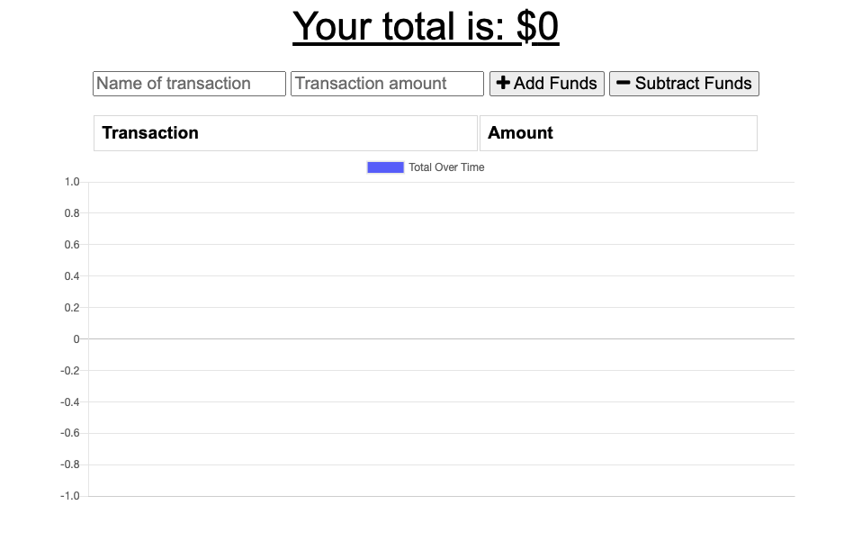

# Budget Tracker

## Description

Having a budget is not always easy. And it is even easier to spend money. Let me help you keep track of the money you have coming in and the money you have going out. 

The user will be able to add expenses and deposit to their budget with or without a connection. When entering transactions offline, it will populate the total when the user is back online. 

Check out the deployed app [here](https://secret-mesa-66183.herokuapp.com/)!


[](https://opensource.org/licenses/MIT)

## Table of Contents:
* [Installation](#installation)
* [Usage](#usage)
* [License](#license)
* [Tests](#test)
* [Questions](#questions)


## Installation
1) Clone this repositiory to your local computer using terminal or bash:

    ```
    git clone https://github.com/Kammielatay/budget-tracker.git
    ```

2) Open folder in your editor of choice (VSC, Sublime, etc.) 

or 

3) [Click here](https://secret-mesa-66183.herokuapp.com/) to use the deployed app

## Usage


## License
Distributed under the [](https://opensource.org/licenses/MIT) License. See [OpenSource.org](https://opensource.org/licenses) for more information.

## Tests
1) Check out the deployed app [here](https://secret-mesa-66183.herokuapp.com/)!


## Questions
If you have any questions, please reach out to me at Kameshialatay@gmail.com